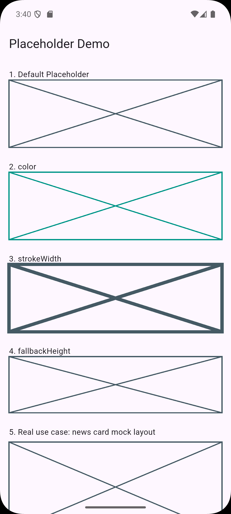

Placeholder Widget Demo
A tiny Flutter app that shows off the built-in Placeholder widget, how it behaves by default, and what happens when you tweak its color, stroke width, and fallback height. There's also a mock news card layout at the bottom so you can see it used in a more realistic way.

How to run
1. Install Flutter if you don't have it already: https://docs.flutter.dev/get-started/install
2. Clone this repo
3. Run flutter pub get to grab the dependencies
4. Run flutter run and pick whatever device or simulator you've got hooked up

That's it, no extra setup needed.

The three attributes
color
Default is a dark blue grey (0xFF455A64). This controls the color of the lines that make up the placeholder box. Handy if you want your placeholder to match a theme or just stand out more while you're prototyping, like the teal example in demo 2.
strokeWidth
Default is 2.0. This controls how thick the lines are. Bumping it up (like to 6 in demo 3) makes the box a lot more noticeable, which can be useful if you're demoing something on a projector or just want it to pop visually.

fallbackHeight
Default is 400.0. This only kicks in when the parent gives unbounded (unlimited) height, like a ListView does. Instead of crashing or collapsing to nothing, it falls back to this height so you always see something on screen. Same idea applies to fallbackWidth if there's no width constraint either.
Screenshots

Sources
Flutter API docs: https://api.flutter.dev/flutter/widgets/Placeholder-class.html